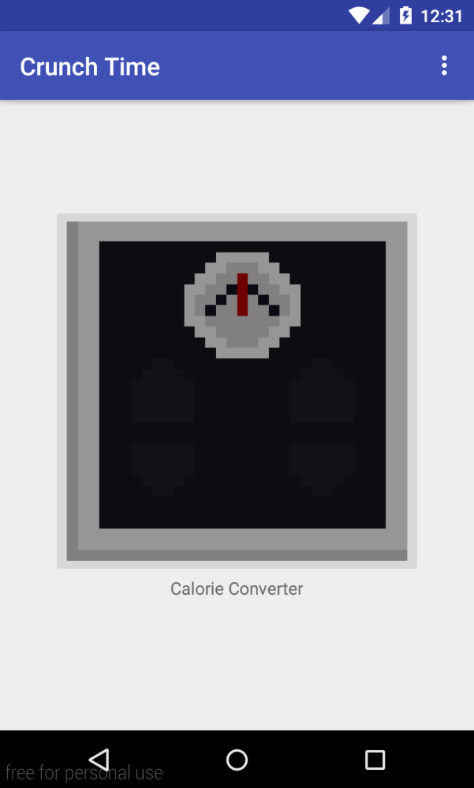
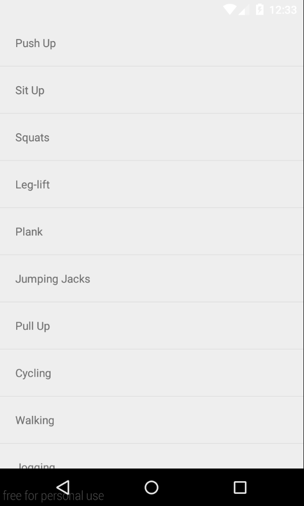
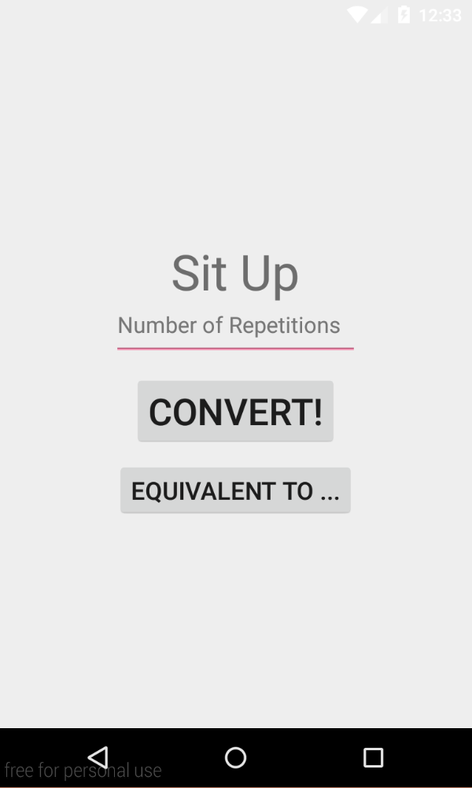
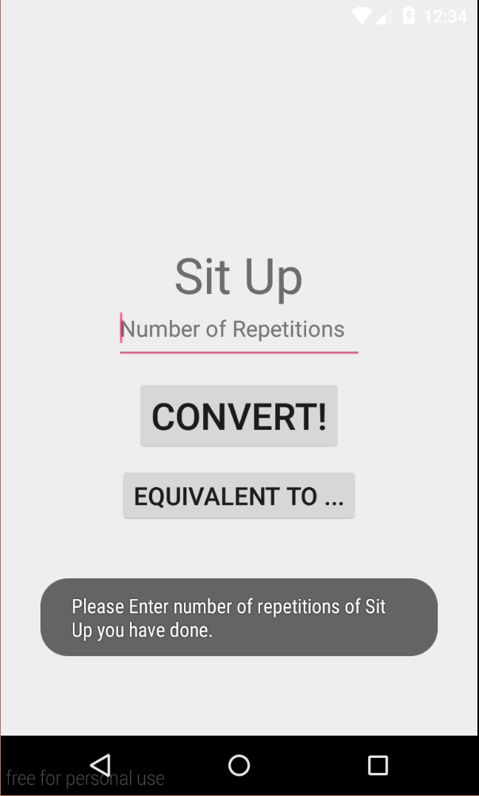
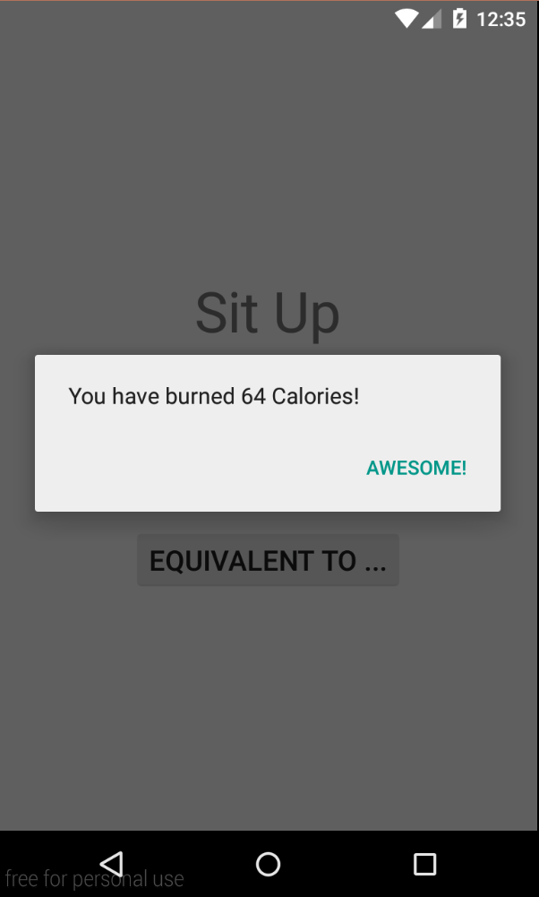
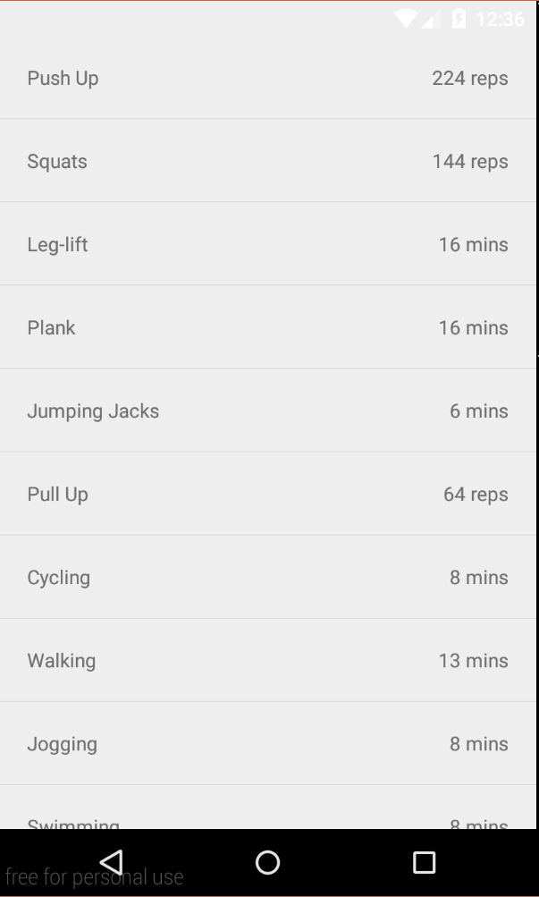

# PROG 01: Crunch Time

Briefly describe your app here.

## Authors

Chung-Hao Yu ([allen.yu@berkeley.edu](mailto:allen.yu@berkeley.edu))

## Demo Video

See [Allen Yu CrunchTime Demo Video] (https://vimeo.com/154394691)

## Screenshots

## Acknowledgments

